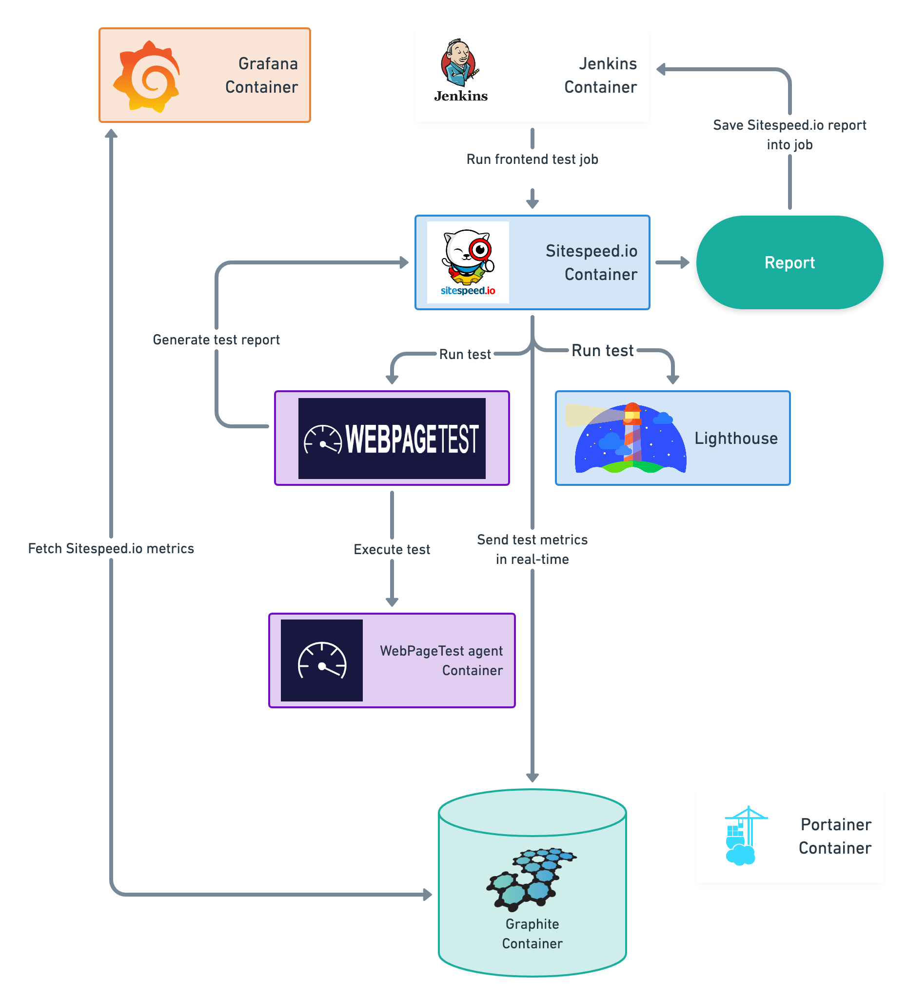
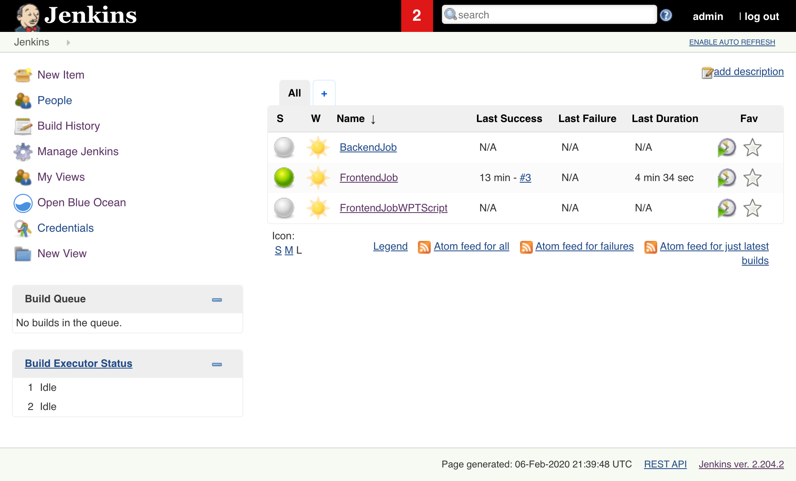
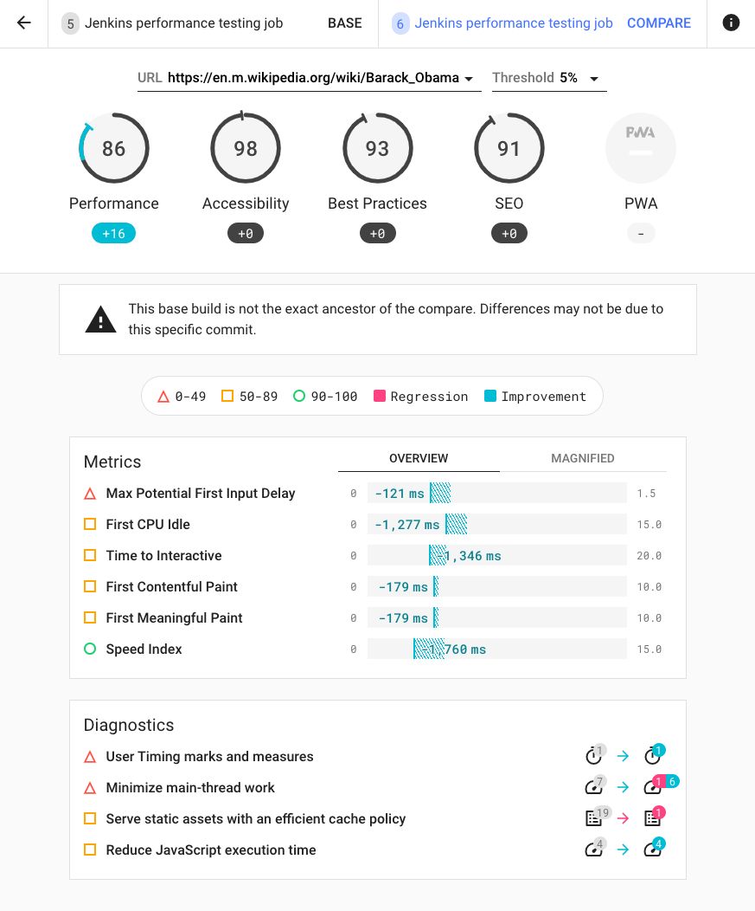
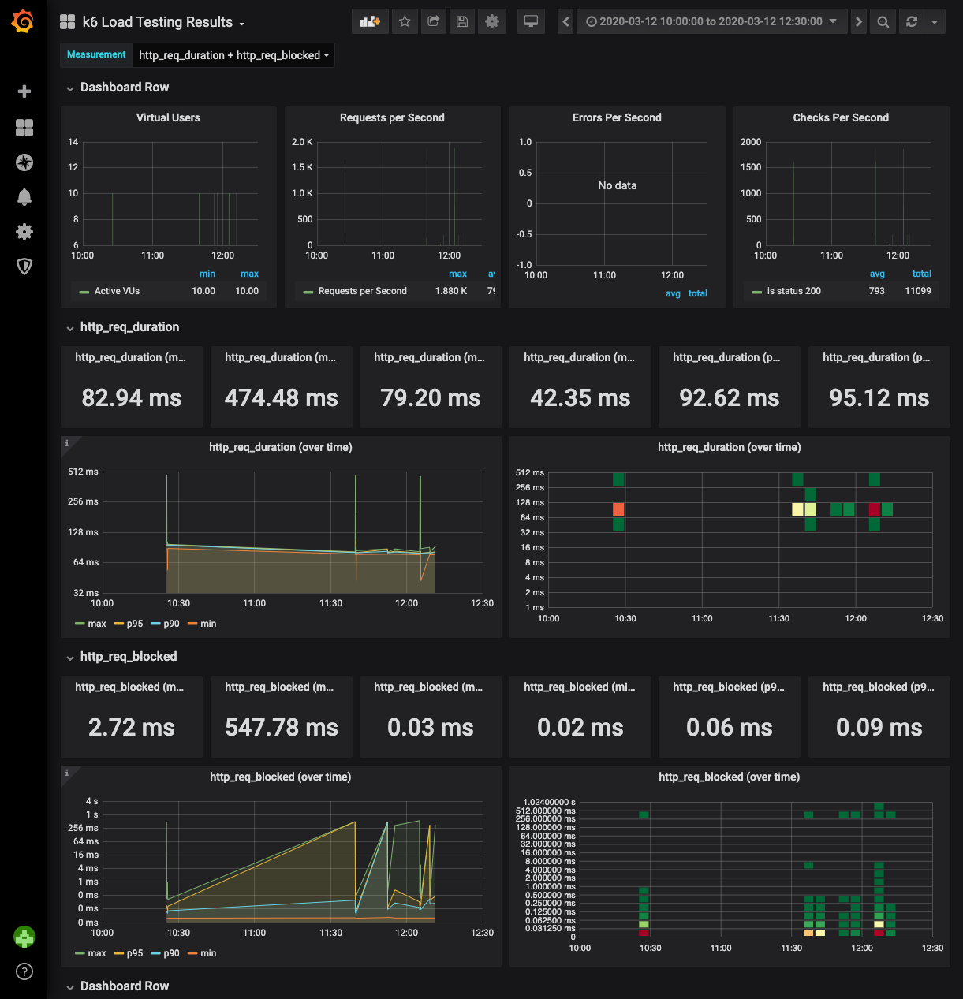
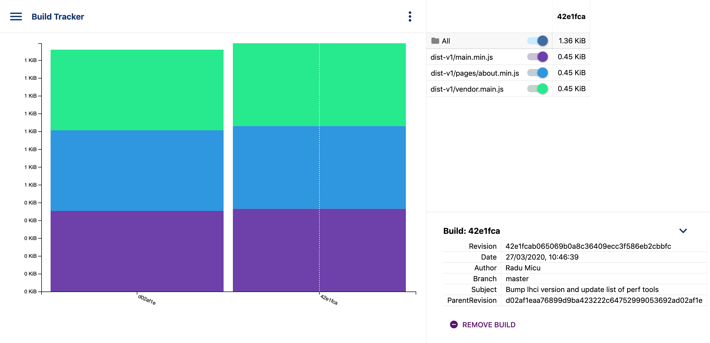
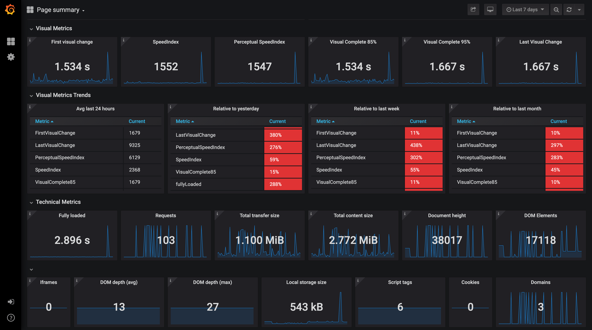

# Performance testing framework

This framework could be used for frontend load testing with sitespeed.io (with lighthouse) and webpagetest private instance.

- [Performance testing framework](#performance-testing-framework)
  - [Getting Started](#getting-started)
  - [Framework architecture:](#framework-architecture)
  - [Prerequisites](#prerequisites)
  - [Installing](#installing)
  - [How to run](#how-to-run)
    - [Services endpoints](#services-endpoints)
    - [How to stop](#how-to-stop)
  - [Jenkins](#jenkins)
    - [Frontend Job](#frontend-job)
    - [LHCI Job](#lhci-job)
    - [K6 Job](#k6-job)
  - [Build Tracker](#build-tracker)
  - [Grafana](#grafana)
    - [Available metrics](#available-metrics)
  - [Useful Docker commands](#useful-docker-commands)
  - [TODO](#todo)
  - [Other examples](#other-examples)

## Getting Started

Framework consists of next services:

- **Jenkins**: continuous integration server for tests execution
- **Sitespeed.io**: set of tools for frontend load testing
- **Webpagetest**: private instance of webpagetest server for frontend tests execution
- **K6**: tool for backend load testing
- **Build Tracker** tool for monitoring asset sizes and performance budgets
- **Grafana**: data visualization & monitoring
- **Graphite**: time series DB platform for metrics
- **InfluxDB**: time series DB optimized for fast storage and retrieval of time series data

Not yet implemented:

- **Portainer**: service for managing docker environment
- **K6 Grafana dashboard**:  The default Grafaba dashboard for K6 for now needs to be [added manually](https://k6.io/docs/results-visualization/influxdb-+-grafana)

## Framework architecture:



## Prerequisites

To run framework install docker: https://docs.docker.com/engine/installation/.

You should be able to run ```docker run hello-world``` with no errors.

## Installing

1. Clone this repository
```git clone https://github.com/serputko/performance-testing-framework.git```
2. open performance-testing-framework dir

## How to run

1. (optional) if you want to update existing services

```shell
docker-compose pull
docker-compose build
docker-compose down
```

2. Run docker services

**On Linux Server**

```shell
sudo modprobe ifb numifbs=1
docker-compose up
```

**On Mac OS / PC**

**Mac OS does not support network shaping.**

```shell
docker compose -f docker-compose.yml -f docker-compose-macos.yml up
```

Native Connection (No Traffic Shaping) will have to be used in order to work as there is no traffic shaping enabled.

All containers should be up and running

### Services endpoints

- **jenkins** [localhost:8181](http://localhost:8181/)
- **LHCI** [localhost:9001](http://localhost:9001/)
- **webpagetest server** [localhost:4000](http://localhost:4000/)
- **build tracker server** [localhost:9002](http://localhost:9002/)
- **grafana** [localhost:3000](http://localhost:3000/)
- **portainer** [localhost:9000](http://localhost:9000/)

### How to stop

```shell
docker compose down
```

## Jenkins

Login to Jenkins with admin/admin (could be changed in docker-compose file)


*(BlueOcean plugin is also available)*

By default jenkins consists of 2 jobs:

- **FrontendJob**: run tests with sitespeed.io and webpagetest private instance
- **BackendJob**: run Jmeter scenarios (NOT YET IMPLEMENTED)

### Frontend Job

To run frontend test: **Open FrontendJob -> Build with Parameters -> Set build parameters -> Build**


This job will start `sitespeed.io plus1` docker container and run test with parameters using the WebPageTest private instance.

Frontend test deliverables:

- **sitespeed.io HTML report**


- **webpagetest HTML report**


### LHCI Job

To run Lighthouse CI test: **Open LighthouseCI -> Build with Parameters -> Set build parameters -> Build**

This job will start `lhci-client` docker container and run test with parameters using Lighthouse, pushing the results to the LHCI server running on http://localhost:9001.



### K6 Job

K6 is a modern load testing tool, using Go and JavaScript. This job will start `k6` into a docker container and will use the provided script from `k6/scripts` folder.

To run K6 Load testing create a [loading script](https://k6.io/docs/using-k6/http-requests) in the `k6/scripts` folder and then **Open K6 Load testing -> Build with Parameters -> Set build parameters -> Build**.

The results will be saved on the associated k6 reports folder and also pushed to the InfluxDB running locally.



*To add this dashboard follow the instructions [here](https://k6.io/docs/results-visualization/influxdb-+-grafana).*

## Build Tracker

*Track performance budgets & prevent unexpected bloat.*



The docker compose services contains the build tracker server that can be used to send build artifacts from the build tracker CLI and monitor.

Once the service is running access [localhost:9002](http://localhost:9002) to see the dashboard.

In order to send build artifacts follow the instructions on the [docs site](https://buildtracker.dev/docs/packages/cli). You can also find an example in the test folder for build tracker in this repo.

## Grafana

### Available metrics

Ready-made dashboards are inserted with a Docker container using curl. You can check out the container with the dashboards here: https://github.com/sitespeedio/grafana-bootstrap-docker

The [Sitespeed.io](https://www.sitespeed.io/documentation/sitespeed.io/performance-dashboard/) team worked hard to make them and the great thing is that you can use them as base dashboards, then create additional dashboards if you like.




## Useful Docker commands

```bash
# Pull and rebuild the entire framework
docker-compose build --pull --force-rm --no-cache

# If you want to run only 1 service
docker-compose -f docker-compose.yml -f docker-compose-macos.yml up lhci-server
```

## TODO

- [ ] Add K6 Grafaba dashboard - https://k6.io/docs/results-visualization/influxdb-+-grafana
- [ ] Run containers from Jenkins via docker-compose or at leaset the built ones
- [ ] Test runs comparison
- [x] Add JMeter or Gantling load testing (UPDATE: Went with K6 as it is very fast and uses less memory.)
- [x] Better docs to explain how it should be run
- [ ] More docs around architecture and how it works
- [ ] Explain how to test localhost using extra_hosts for wpt-agent
- [ ] jenkins-cli.jar should already be part of `/var/jenkins_home/war/WEB-INF/jenkins-cli.jar` but when I build it, it was not so I had to manually copy it.

## Other examples

- Anton Serputko perf testing framework (from which this one was inspired) - https://github.com/serputko/performance-testing-framework
- Garie - https://garie.netlify.com/
- OpenSpeedMonitor - https://github.com/iteratec/OpenSpeedMonitor
